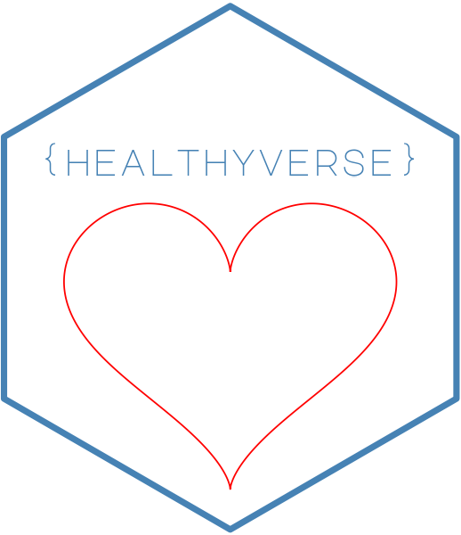

```{r setup, include=FALSE}
knitr::opts_chunk$set(echo = TRUE)
```




#
> __healthyverse:__ Easily install and load all healthyR packages

<!-- badges: start -->
[](https://cran.r-project.org/package=healthyverse)


[](https://lifecycle.r-lib.org/articles/stages.html##stable)
[](http://makeapullrequest.com)
<!-- badges: end -->

Purpose

This package is not yet avilable on CRAN but it has been submitted. The intent of this library
is to make it easy to install and update to the latests version of all of the `healthyR` packages.

`healthyverse` can be found [here](https://www.spsanderson.com/healthyverse)

> __healthyR:__ A toolkit for hospital data

<!-- badges: start -->
[](https://cran.r-project.org/package=healthyR)


[](https://www.tidyverse.org/lifecycle/#experimental)
[](http://makeapullrequest.com)
<!-- badges: end -->

Purpose

The beginning of `healthyR` started from an idea that popped into my head while
at work. I was looking for a way to democratize the gathering of and visualization 
of data in both the administrative and clinical sense. This led me to build out
`LICHospitalR` a package for my employer that is under active development just like 
`healthyR`. 

`healthyR` can be found [here](https://www.spsanderson.com/healthyR)

> __healthyR.data:__ A companion data only package to `healthyR`

<!-- badges: start -->
[](https://cran.r-project.org/package=healthyR.data)


[](https://lifecycle.r-lib.org/articles/stages.html##stable)
[](http://makeapullrequest.com)
<!-- badges: end -->

Purpose

The `healthyR.data` package provides a useful simulated data-set that can be used for all sorts
of data analysis, including time-series and machine learning.

`healthyR.data` can be found [here](https://www.spsanderson.com/healthyR.data)

> __healthyR.ts:__ A time-series analysis and modeling verb framework to `healthyR`

<!-- badges: start -->
[](https://cran.r-project.org/package=healthyR.ts)


[](https://lifecycle.r-lib.org/articles/stages.html#experimental)
[](http://makeapullrequest.com)
<!-- badges: end -->

Purpose

The goal of healthyR.ts is to provide a consistent verb framework for performing time series analysis and forecasting on both administrative and clinical hospital data.

`healthyR.ts` can be found [here](https://www.spsanderson.com/healthyR.ts)

<!-- badges: start -->
[](https://cran.r-project.org/package=healthyR.ai)


[](https://lifecycle.r-lib.org/articles/stages.html#experimental)
[](http://makeapullrequest.com)
<!-- badges: end -->

Purpose

The gola of healthyR.ai is to provide a consistent verb framework for performing data modeling
and forecasting for problems like classification and regression on both administrative and clinical
hospital data.

`healthyR.ai` can be found [here](https://www.spsanderson.com/healthyR.ai)