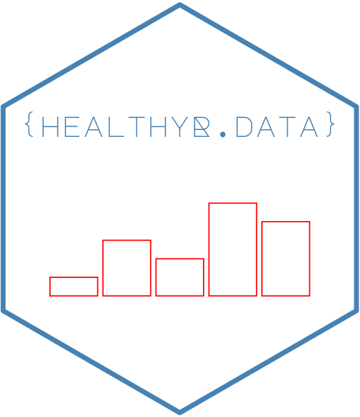

```{r setup, include=FALSE}
knitr::opts_chunk$set(echo = TRUE)
```





#
> __healthyverse:__ Easily install and load all healthyR packages

<!-- badges: start -->
[](https://cran.r-project.org/package=healthyverse)


[](https://lifecycle.r-lib.org/articles/stages.html##stable)
[](http://makeapullrequest.com)
<!-- badges: end -->

Purpose

The intent of this library is to make it easy to install and update to the latets version of all of the `healthyR` packages.

`healthyverse` can be found [here](https://www.spsanderson.com/healthyverse)