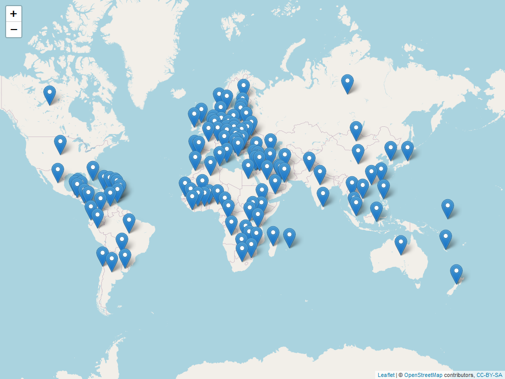

```{r setup, include=FALSE}
knitr::opts_chunk$set(
  echo = TRUE, 
  warning = FALSE, 
  message = FALSE,
  fig.path = "man/figures/README-",
  fig.width = 12,
  fig.height = 10
  )
```


#
> __2021__ A Year in Review

The year 2021 was a big year for me. I did a lot of coding, a lot more than I 
typically do. The biggest push came personally in my ongoing development of my
R packages that are in the [healthyverse](www.spsanderson.com/healthyverse/). To
use the __healthyverse__ simply do so in the familiar fashion:

```{r install_healthyverse, echo=TRUE, eval=FALSE}
install.packages("healthyverse")
library(healthyverse)
```

Here are links to all of the packages:

-   [`healthyR`](https://www.spsanderson.com/healthyR/)
-   [`healthyR.data`](https://www.spsanderson.com/healthyR.data/)
-   [`healthyR.ts`](https://www.spsanderson.com/healthyR.ts/)
-   [`healthyR.ai`](https://www.spsanderson.com/healthyR.ai/)
-   [`healthyverse`](https://www.spsanderson.com/healthyverse/)

In order to start looking at some of the data that pertains to 2021 lets first
get the data from the CRAN logs. Since I do this daily already, I can simply use
the rds file I already have. I am going to go through the motions though, in case
others might want to do something similar. The functions I am using to get the 
data can [be found here](https://github.com/spsanderson/healthyverse_tsa/blob/master/00_scripts/get_data_functions.R)

Now lets get that data!
```{r get_data}
library(tidyverse)
library(lubridate)
source("01_scripts/get_data_functions.R")
source("01_scripts/data_manipulation_functions.R")
source("01_scripts/mapping_functions.R")

get_cran_data()
get_package_release_data()
csv_to_rds()
```

Ok now that we have our data, lets ensure that we are only using the year 2021.
We can do this by filtering out data by time with the [timetk](https://business-science.github.io/timetk/) package. 

Now lets filter our data below, some pre-processing may need to take place.

```{r make_tibble}
library(timetk)
data_tbl <- downloads_processed_tbl() %>%
  filter_by_time(
    .date_var = date,
    .start_date = "2021",
    .end_date = "2021"
  )

glimpse(data_tbl)
```

Now that we have our data, we have it for the year 2021 only with a start date
of `r min(data_tbl$date)` and an end date of `r max(data_tbl$date)`.

# Package Information

The first thing we will do is look at how many downloads there were for each pacakge
and it's version.

```{r dl_by_pkg_v}
library(knitr)

data_tbl %>% 
  count(package, version) %>% 
  pivot_wider(
    id_cols       = version
    , names_from  = package
    , values_from = n
    , values_fill = 0
    ) %>%
  arrange(version) %>%
  kable()
```

Now lets see how many total downloads for the year there were for each package.

```{r total_dl}
data_tbl %>%
  count(package) %>%
  set_names("Package","Total Downloads") %>%
  kable()

data_tbl %>%
  select(package, version) %>%
  group_by(package) %>%
  distinct() %>%
  mutate(release_count = n()) %>%
  ungroup() %>%
  select(package, release_count) %>%
  distinct() %>%
  set_names("Package", "Number of Releases") %>%
  kable()

total_number_of_releases <- data_tbl %>%
  select(package, version) %>%
  group_by(package) %>%
  distinct() %>%
  mutate(release_count = n()) %>%
  ungroup() %>%
  select(package, release_count) %>%
  distinct() %>%
  summarise(total = sum(release_count, na.rm = TRUE))
  
```

So all in all there was a total of `r nrow(data_tbl) %>% scales::number(big.mark=",")` downloads of all the `healthyverse` packages in 2021. There were in total `r total_number_of_releases` package releases as well.

# Graphs
Now lets graph the data out!

```{r gaph_of_downloads}
data_tbl %>%
  count(package, version) %>%
  ggplot(aes(x = version, y = n, alpha = 0.382)) +
  geom_col(aes(group = package, fill = package)) +
  facet_wrap(package ~., ncol = 2, scales = "free") +
  scale_y_continuous(labels = scales::label_number(big.mark = ",")) +
  theme_minimal() +
  theme(legend.position = "bottom") +
  labs(
    title = "Downloads by Package for 2021",
    subtitle = "Faceted by Package",
    x = "Version",
    y = "Downloads",
    fill = "Package"
  )

data_tbl %>%
  count(package, version) %>%
  group_by(package) %>%
  mutate(cumulative_downloads = cumsum(n)) %>%
  mutate(record = row_number()) %>%
  ungroup() %>%
  ggplot(aes(x = record, y = cumulative_downloads, alpha = 0.382)) +
  geom_col(aes(group = package, fill = package)) +
  facet_wrap(package ~., ncol = 2, scales = "free") +
  scale_y_continuous(labels = scales::label_number(big.mark = ",")) +
  theme_minimal() +
  theme(legend.position = "bottom") +
    labs(
    title = "Downloads by Package for 2021",
    subtitle = "Faceted by Package",
    x = "Relase Number",
    y = "Downloads",
    fill = "Package"
  )

data_tbl %>%
  count(package, version) %>%
  group_by(package) %>%
  mutate(cumulative_downloads = cumsum(n)) %>%
  mutate(record = row_number()) %>%
  ungroup() %>%
  ggplot(aes(x = record, y = cumulative_downloads, alpha = 0.382)) +
  geom_line(aes(color = package, group = package), size = 1) +
  scale_y_continuous(labels = scales::label_number(big.mark = ",")) +
  theme_minimal() +
  theme(legend.position = "bottom") +
  labs(
    title = "Cumulative Downloads by Package for 2021",
    subtitle = "Colored by Package",
    x = "Release Number",
    y = "Downloads",
    color = "Package"
  )
```

# Time Series Graphs
Now lets get some time-series graphs.

```{r ts_plots}
library(healthyR.ts)
pkg_tbl <- readRDS("00_data/pkg_release_tbl.rds")

data_tbl %>% 
  summarise_by_time(.date_var = date, n = n()) %>% 
  ts_calendar_heatmap_plot(.date_col = date, .value_col = n, .interactive = FALSE)

data_tbl %>%
  ts_downloads_tbl(.by_time = "day", package) %>%
  ggplot(aes(date, log1p(value))) +
  geom_point(aes(group = package, color = package), size = 1) +
  ggtitle(paste("Package Downloads: {healthyverse}")) +
  geom_smooth(method = "loess", color = "black",  se = FALSE) +
  geom_vline(
    data = pkg_tbl
    , aes(xintercept = as.Date(date))
    , color = "red"
    , lwd = 1
    , lty = "solid"
  ) +
  facet_wrap(package ~., ncol = 2, scales = "free_x") +
  theme_minimal() +
  labs(
    subtitle = "Vertical lines represent release dates",
    x = "Date",
    y = "log1p(Counts)",
    color = "Package"
  ) +
  theme(legend.position = "bottom")

data_tbl %>%
  ts_downloads_tbl(.by_time = "day") %>%
  rename(Actual = value) %>%
  tk_augment_differences(.value = Actual, .differences = 1) %>%
  tk_augment_differences(.value = Actual, .differences = 2) %>%
  rename(velocity = contains("_diff1")) %>%
  rename(acceleration = contains("_diff2")) %>%
  pivot_longer(-date) %>%
  mutate(name = str_to_title(name)) %>%
  mutate(name = as_factor(name)) %>%
  ggplot(aes(x = date, y = log1p(value), group = name)) +
  geom_point(alpha = .2) +
  geom_vline(
    data = pkg_tbl
    , aes(xintercept = as.Date(date), color = package)
    , lwd = 1
    , lty = "solid"
  ) +
  facet_wrap(name ~ ., ncol = 1, scale = "free") +
  theme_minimal() +
  labs(
    title = "Total Downloads: Trend, Velocity, and Accelertion",
    subtitle = "Vertical Lines Indicate a CRAN Release date for a package.",
    x = "Date",
    y = "",
    color = ""
  ) +
  theme(legend.position = "bottom")

data_tbl %>%
  ts_downloads_tbl(.by_time = "day") %>%
  plot_seasonal_diagnostics(
    .date_var = date,
    .value = log1p(value),
    .interactive = FALSE
  ) +
  theme_minimal() +
  labs(
    title = "Seasonal Diagnostics",
    subtitle = "Values are log1p"
  )

data_tbl %>%
  ts_downloads_tbl(.by_time = "day") %>%
  plot_stl_diagnostics(
    .date_var = date,
    .value = log1p(value),
    .interactive = FALSE
  ) +
  theme_minimal() +
  labs(
    title = "STL Diagnostics",
    subtitle = "Values are log1p"
  )
```

# Mapping

So now that we have seen all the downloads in variaous ways, where did they all
come from? Lets take a look.

```{r mapping}
library(tmaptools)
library(countrycode)
library(mapview)
library(htmlwidgets)
library(webshot)

mapping_dataset(.data_year = "2021") %>%
  head() %>%
  knitr::kable()

# l <- map_leaflet(.data = data_tbl)
# mapshot(x = l, file = "map.png")

l <- map_leaflet()
saveWidget(l, "downloads_map.html")
webshot("downloads_map.html", file = "map.png",
        cliprect = "viewport")
```

<!--  -->
There was a total of `r nrow(readRDS("00_data/mapping_dataset.rds"))` different 
countries that downloaded `healthyverse` packages in 2021.

# GitHub Stats

Now lets take a look at some quick stats from my [GitHub](https://www.github.com/spsanderson/)

First my contribution grid:


Secondly my badge:

