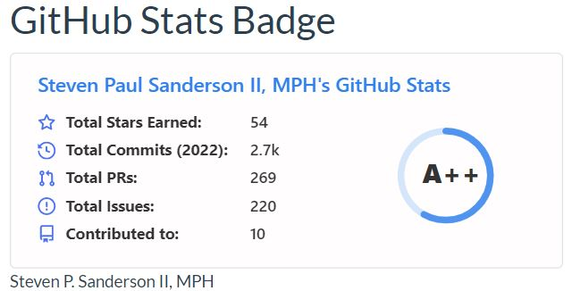

```{r setup, include=FALSE}
knitr::opts_chunk$set(echo = TRUE)
```


#
> __2021__ A Year in Review

The year 2021 was a big year for me. I did a lot of coding, a lot more than I 
typically do. The biggest push came personally in my ongoing development of my
R packages that are in the [healthyverse](www.spsanderson.com/healthyverse/). To
use the __healthyverse__ simply do so in the familiar fashion:

```{r install_healthyverse, echo=TRUE, eval=FALSE}
install.packages("healthyverse")
library(healthyverse)
```

# GitHub Stats

Now lets take a look at some quick stats from my [GitHub](https://www.github.com/spsanderson/)

First my contribution grid:


Secondly my badge:

